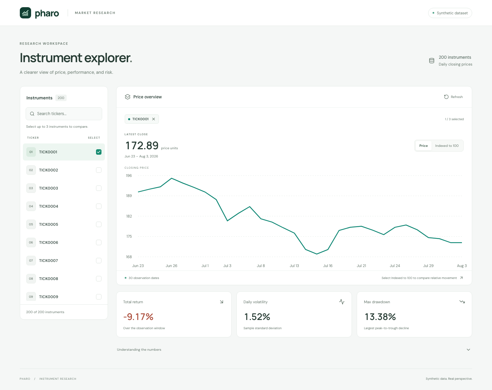
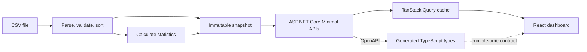

# Pharo · Instrument explorer

A small, complete instrument research dashboard built with **React, TypeScript, Vite, and ASP.NET Core**. Browse 200 instruments, inspect daily closing prices, and compare performance and risk across up to three instruments.

The supplied dataset contains **6,000 observations**: 200 tickers with 30 prices each, from **June 23 to August 3, 2026**.

> **Note:** I have intentionally limited the application to the 30 daily price observations per instrument in the provided CSV, following the API scope specified in the assessment instructions. The application returns the full available series and does not support dynamic price fetching or filtering by a requested date range.



[Run locally](#run-locally) · [Architecture](#architecture) · [API](#api) · [Calculation conventions](#calculation-conventions) · [Verification](#verification)

## AI Usage

- Relied heavily on AI to implement the ASP.NET Core backend, as I had no prior experience with .NET.
- Relied on AI to write unit tests and to create end-to-end browser tests using Playwright.
- Relied on AI to create an orchestration script that starts the frontend and backend with a single command and is designed to work on Windows, macOS, and Linux.
- Used AI to help write React code while retaining control over design decisions, code organization, and the choice of tools and libraries. CSS and visual design mostly generated by AI.

## A quick evaluation path

1. Start the app with the instructions below. `TICK0001` is selected initially, showing its full price history and three computed statistics.
2. Search for `tick000` and select `TICK0002` and `TICK0003`. A fourth selection is disabled until one is removed.
3. Switch between **Price** and **Indexed to 100**. The latter compares relative movement despite different price levels. The statistics continue to describe the original series.
4. Remove the selections to see the empty state. Clear the search to return to all instruments.
5. Open **Understanding the numbers** for the calculation conventions.

## Tooling requirements

| Tool     | Minimum for this repository                | Purpose                                                                                                                                                                                                               |
| -------- | ------------------------------------------ | --------------------------------------------------------------------------------------------------------------------------------------------------------------------------------------------------------------------- |
| .NET SDK | **10.0.400**                               | C# compiler, ASP.N, or run the tests to exercise API failures, recovery, and keyboard interaction.ET Core runtime, NuGet, tests, and file watching. `global.json` accepts later patches in the same SDK feature band. |
| Node.js  | **22.13.0** on the Node 22 line            | Vite, TypeScript, linting, test runners, and root scripts. Supported alternatives are Node 24 or Node 26+. `.nvmrc` selects **22.22.1**, the version used for local verification.                                     |
| npm      | **10.0.0**                                 | Workspace dependency installation and commands. Usually included with Node.                                                                                                                                           |
| Browser  | A current Chrome, Edge, Firefox, or Safari | Use the dashboard. Automated browser tests use a separately installed Playwright Chromium.                                                                                                                            |
| Git      | **2.x**, optional for a downloaded ZIP     | Clone the repository and review changes.                                                                                                                                                                              |

Use a [.NET-supported operating system](https://learn.microsoft.com/en-us/dotnet/core/install/). No database, Docker, additional .NET workloads, globally installed Vite, or separate NuGet CLI is required. Internet access is needed for the initial dependency and test-browser downloads; fonts, data, and frontend assets are subsequently served locally.

The .NET **SDK** includes the runtime and development tools. On macOS, it can be installed with `brew install --cask dotnet-sdk`; choose the native Arm64 SDK on Apple Silicon if using the [Microsoft installer](https://dotnet.microsoft.com/en-us/download/dotnet/10.0).

Verify the tools in a terminal opened at the repository root:

```sh
dotnet --version
node --version
npm --version
```

If using nvm, run `nvm install` and `nvm use` here before installing dependencies. Node 22.13+ meets the combined requirements of this repository's Vite, ESLint, and Vitest versions; the repository minimum is slightly higher than Vite's own minimum.

## Run locally

### 1. Install dependencies

Open the cloned or extracted `pharo` directory, then run:

```sh
npm ci
dotnet restore Pharo.sln --locked-mode
```

`npm ci` installs dependencies for the root package and the frontend workspace from the committed lockfile. The .NET command restores packages from the committed NuGet lockfiles. Run the commands at the root; separate frontend dependency installations are unnecessary.

### 2. Start development servers

```sh
npm run dev
```

Open **http://127.0.0.1:5173**.

The command starts Vite on port **5173** and the API on port **5080**. React changes refresh through Vite; C# changes use `dotnet watch`. Both processes stay attached to the terminal. **Ctrl+C stops both.**

The frontend requests relative `/api/...` URLs. Vite forwards those requests to ASP.NET Core, so development uses the same frontend URL paths as the published application. Local HTTP keeps setup independent of trusted development certificates.

To run the processes separately, use two terminals at the root:

```sh
# Terminal 1: backend, with file watching
dotnet watch --project src/api
```

```sh
# Terminal 2: frontend
npm run dev --workspace @pharo/web
```

For the backend without watching:

```sh
dotnet run --project src/api
```

### 3. Verify the API

```sh
curl http://127.0.0.1:5080/api/instruments
curl http://127.0.0.1:5080/api/prices/TICK0001
curl http://127.0.0.1:5080/api/prices/TICK0001/stats
```

During development, the OpenAPI document is available at **http://127.0.0.1:5080/openapi/v1.json**. The build-generated copy is committed at [`contracts/openapi.json`](contracts/openapi.json).

### Run the built application

```sh
npm run build
npm start
```

Open **http://127.0.0.1:5080**. This is a single ASP.NET Core process serving both the API and compiled React assets. Node is needed to build, but the published application runs on the ASP.NET Core runtime.

The build checks API contract consistency, builds React, publishes .NET in Release mode, and assembles everything under `artifacts/app/`, including `Data/market_data.csv`, local fonts, and `wwwroot/`. Run `npm run build` again after source changes to update this output.

You can also launch the output directly:

```sh
cd artifacts/app
dotnet Pharo.Api.dll --urls http://127.0.0.1:5080
```

## Architecture



### Repository structure

```text
pharo/
├── README.md
├── Pharo.sln                            API and backend tests
├── global.json                         .NET SDK selection
├── package.json                        npm workspace and root commands
├── data/market_data.csv                Single authoritative dataset
├── contracts/openapi.json              Generated HTTP contract
├── docs/dashboard.png                  Screenshot of the working app
├── src/
│   ├── api/
│   │   ├── Program.cs                  Composition, startup, and hosting
│   │   ├── Instruments/                Routes and response records
│   │   ├── MarketData/                 CSV parsing and immutable store
│   │   └── Statistics/                 Pure statistical calculations
│   └── web/src/
│       ├── app/                        Providers and render error boundary
│       ├── api/                        HTTP helper and generated types
│       ├── features/instruments/       Dashboard, selection, queries, chart
│       ├── components/                 Reusable request-error UI
│       ├── styles/                     Global styles and theme variables
│       └── test/                       Frontend test setup
├── tests/
│   ├── Pharo.Api.Tests/                Calculation, loader, and HTTP tests
│   └── e2e/                            Published-app browser tests
└── scripts/                            Development and build orchestration
```

Frontend unit and component tests live beside the behavior they verify.

### Why these choices

| Decision                                       | Reason and tradeoff                                                                                                                                                                                                                                          |
| ---------------------------------------------- | ------------------------------------------------------------------------------------------------------------------------------------------------------------------------------------------------------------------------------------------------------------ |
| **React + Vite SPA**                           | A single interactive workspace with a dedicated C# backend has a clear client/server boundary. Vite supplies fast iteration and static production assets; server rendering and an additional server-side JavaScript framework add little to this assessment. |
| **Minimal APIs and explicit response records** | The handlers expose HTTP behavior directly. They delegate calculations and loading, and their typed responses feed OpenAPI generation.                                                                                                                       |
| **Immutable in-memory snapshot**               | The fixed, 6,000-row input is small. Startup loads, validates, sorts, and precomputes once. Concurrent readers share immutable arrays and a frozen dictionary. Statistics requests are lookups; no database or cache invalidation service is needed.         |
| **CsvHelper and strict validation**            | Quoting, header mapping, and CSV structure use an established parser. Dates and decimal prices are parsed with invariant culture. Invalid input fails startup with an actionable message, usually including the row.                                         |
| **TanStack Query + native fetch**              | Query keys include the resource and ticker. The cache owns server data, while React owns search, selection, and chart mode. Prices and statistics load in parallel and can succeed or fail independently.                                                    |
| **Generated API types**                        | C# response records produce OpenAPI, which generates TypeScript types. This prevents independently maintained C#/TypeScript response definitions from drifting. Generated types are compile-time contracts, not runtime response validators.                 |
| **Recharts**                                   | A maximum of three series with 30 observations each suits an SVG line chart. The chart module loads separately, keeping the initial UI bundle smaller. Straight segments show the actual observations without smoothing.                                     |
| **CSS Modules + local variable fonts**         | Component styles remain scoped; shared colors and typography live in the global stylesheet. Layout responds to smaller screens. Font packages remove external runtime font requests.                                                                         |
| **npm workspaces + small Node scripts**        | One npm lockfile and a handful of root commands coordinate two toolchains. Scripts avoid requiring Bash, Make, or an additional monorepo framework.                                                                                                          |

### Data lifecycle and client state

The API loads data **before accepting requests**, using the file copied beside the compiled assembly. It validates headers, positive decimal prices, valid ISO dates, supported ticker characters, and unique ticker/date pairs. Tickers are trimmed and normalized to uppercase; dates are sorted. The loader is not hardcoded to 200 instruments or 30 observations.

Each instrument's series and statistics become one immutable snapshot. The source CSV is never reparsed on a request. **Restart the API after changing the dataset.** There is no live file reload or upload endpoint.

The browser caches successful queries as fresh for the session; inactive entries expire after 30 minutes. There is no polling or window-focus refresh. The **Refresh** button refetches active data. Network/server failures get one automatic retry; a `404` does not. Requests time out after 10 seconds, and disposed queries can cancel their fetches.

Selection is an ordered array of zero to three tickers. The initial selection is the first returned instrument; explicitly clearing it stays empty. Search is a case-insensitive local substring filter. Price and statistics failures have independent retry controls, and successful comparison series remain visible. If a refresh fails after data was loaded, the UI labels the retained values as previously loaded.

Chart rows are joined by **date**, not array position. Missing observations produce gaps. Dates remain date-only values and are formatted in UTC to avoid shifting an observation into the previous day. Price axes use unspecified **price units**, because no currency is present in the dataset.

## API

All endpoints are read-only and return JSON. Ticker lookup is case-insensitive; successful responses return the canonical uppercase ticker.

| Method | Route                        | Response                                                                     |
| ------ | ---------------------------- | ---------------------------------------------------------------------------- |
| GET    | `/api/instruments`           | Sorted array of ticker strings                                               |
| GET    | `/api/prices/{ticker}`       | `{ ticker, prices: [{ date, price }] }`, oldest observation first            |
| GET    | `/api/prices/{ticker}/stats` | `{ ticker, totalReturnPercent, dailyVolatilityPercent, maxDrawdownPercent }` |

Both ticker-specific routes return **404 Problem Details** for an unknown instrument. Other API paths also return JSON errors rather than the React HTML fallback. Unexpected exceptions use ASP.NET Core's exception handler and Problem Details.

All three statistics use **percentage points**: a JSON value of `8` means `8%`. Undefined statistics are `null`. Numeric values are JSON numbers, dates are `YYYY-MM-DD` strings, and rounding is applied only for display.

When changing the API contract:

```sh
npm run contracts
```

Include both `contracts/openapi.json` and `src/web/src/api/schema.d.ts` in the change. `npm run contracts:check` detects drift; `npm run check` and `npm run build` include that check. TypeScript is pinned to **5.9** because `openapi-typescript` 7 declares TypeScript 5 support.

## Calculation conventions

Let prices be chronologically ordered as `P₀ … Pₙ₋₁`, and daily simple returns be `rᵢ = Pᵢ / Pᵢ₋₁ − 1`.

| Metric           | Definition                                                                                 |
| ---------------- | ------------------------------------------------------------------------------------------ |
| Total return     | `(last price / first price − 1) × 100`                                                     |
| Daily volatility | `sqrt(sum((rᵢ − mean return)²) / (m − 1)) × 100`, where `m` is the number of daily returns |
| Maximum drawdown | `max((running peak − current price) / running peak) × 100`                                 |

- **Volatility is sample standard deviation**, not population standard deviation, and is not annualized. Thirty prices produce 29 returns and a sample-variance denominator of 28. Welford's algorithm accumulates variance without subtracting large, nearly equal sums.
- **Drawdown is a nonnegative magnitude.** Its peak must precede the trough. For `100 → 120 → 90 → 108`, total return is **8%** and maximum drawdown is **25%**.
- **Short series:** no prices gives three `null` statistics; one price gives zero total return and drawdown, with `null` volatility. Two prices still give `null` sample volatility. The CSV loader rejects an entirely empty dataset. The UI renders undefined values as `—`.
- **Indexed comparison:** each series is transformed to `price / its first price × 100`. This is a frontend display transformation. It never changes the backend statistics. If an alternative dataset has different start dates, each series starts at its own first observation.

These choices resolve the interpretation left open by the assessment and are covered by known-answer tests.

## Verification

```sh
# Formatting, API contracts, C# formatting, ESLint, TypeScript, and unit/integration tests
npm run check

# Just backend and frontend unit/integration tests
npm test

# Browser tests against a fresh production build
npm run build
npm run test:e2e:install
npm run test:e2e
```

On Linux, install Playwright's OS dependencies with `npx playwright install --with-deps chromium`. Browser tests start their own published server on **5180**, then stop it. They do not require the development servers. Failure screenshots and traces are written to `test-results/`; inspect the HTML report with `npx playwright show-report`.

| Coverage                    | What it establishes                                                                                                                                 |
| --------------------------- | --------------------------------------------------------------------------------------------------------------------------------------------------- |
| **C# calculation tests**    | Hand-computable returns and volatility, peak-before-trough drawdown, flat prices, insufficient observations, and invalid prices                     |
| **CSV loader tests**        | Quoting, normalization, chronological ordering, locale independence, duplicate detection, and malformed input                                       |
| **HTTP integration tests**  | Real endpoint behavior with the supplied CSV, all 200 tickers, 30 observations, consistent responses, and Problem Details                           |
| **Frontend tests**          | Selection limits, search persistence, date joins, indexing, date formatting, percentage display, and HTTP error handling                            |
| **Playwright tests**        | Real published-app browsing and comparison, keyboard use, a 390px viewport, partial failures, unknown instruments, recovery, and static/API routing |
| **axe accessibility check** | Automated WCAG A/AA checks on the loaded dashboard; this complements keyboard tests and is not a complete manual accessibility audit                |

Local validation was performed on macOS with Apple Silicon.

## Configuration and troubleshooting

Defaults are sufficient for the included dataset. No `.env` file or secrets are required.

| Setting            | Default                        | Behavior                                                                                  |
| ------------------ | ------------------------------ | ----------------------------------------------------------------------------------------- |
| `API_PORT`         | `5080`                         | API port for root `dev` and `start` commands                                              |
| `WEB_PORT`         | `5173`                         | Vite port for the root `dev` command                                                      |
| `API_PROXY_TARGET` | `http://127.0.0.1:5080`        | Vite proxy target when starting the frontend separately; root `dev` sets it automatically |
| `MarketData__Path` | Bundled `Data/market_data.csv` | Alternative CSV path; use an absolute path to avoid content-root ambiguity                |

For example, in a POSIX shell:

```sh
API_PORT=5090 WEB_PORT=5174 npm run dev
```

In PowerShell:

```powershell
$env:API_PORT = '5090'
$env:WEB_PORT = '5174'
npm run dev
```

- **SDK not found:** run `dotnet --list-sdks` and install the SDK selected by `global.json`. A runtime-only installation cannot compile this project. Reopen the terminal after installation.
- **Port already in use:** stop the earlier process or set the ports above. Vite deliberately fails instead of silently switching ports.
- **CSV startup failure:** check the reported row and expected `date,ticker,price` columns. Supply positive decimal prices and unique ticker/date pairs. Restart after correcting the data.
- **Frontend cannot reach the API:** confirm the API is running and that a separately started Vite instance uses the correct `API_PROXY_TARGET`.
- **Published app missing or outdated:** run `npm run build` before `npm start`. The development server reads source files; the published server reads `artifacts/app`.
- **Contract check fails:** run `npm run contracts`, review the generated changes, and rerun the check.
- **Playwright cannot find Chromium:** run `npm run test:e2e:install` after dependency installation or a Playwright upgrade.